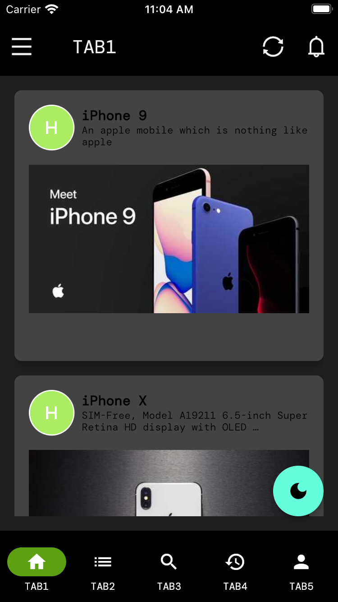
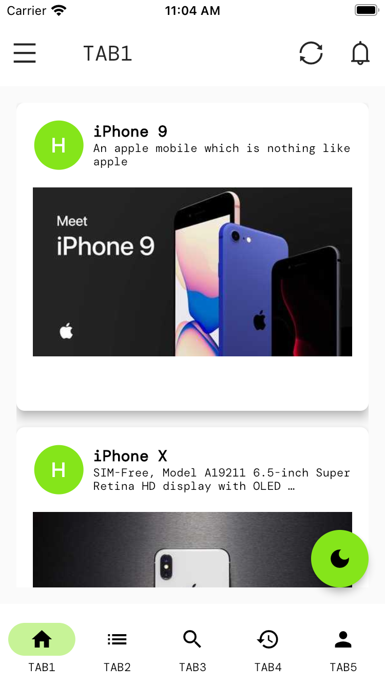
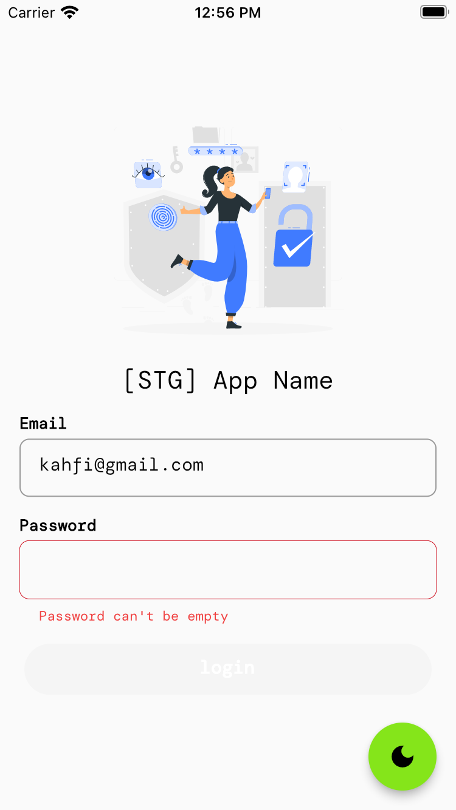
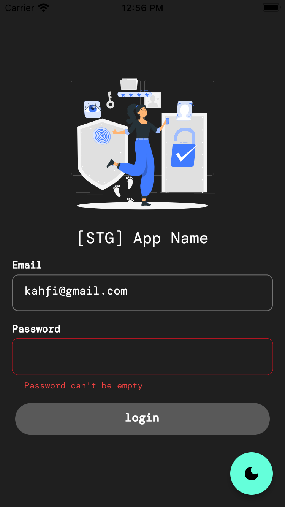
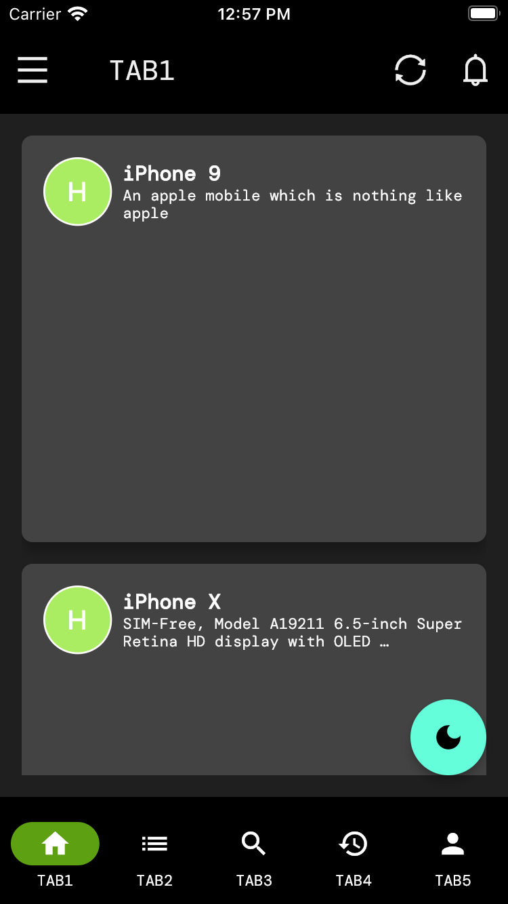
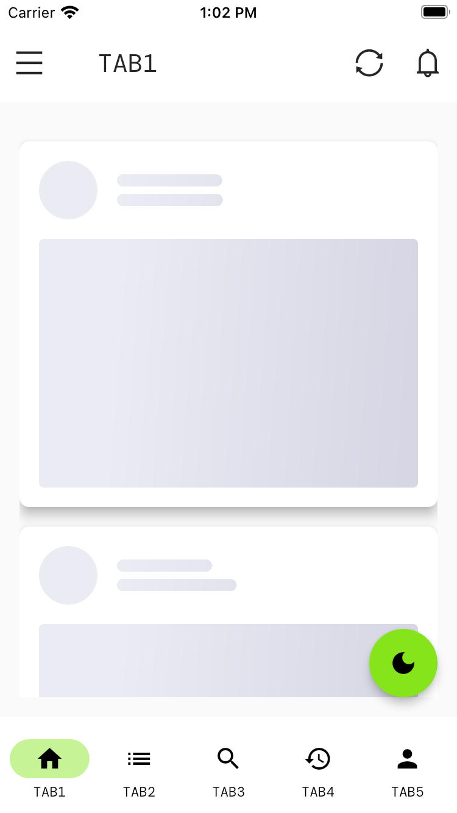
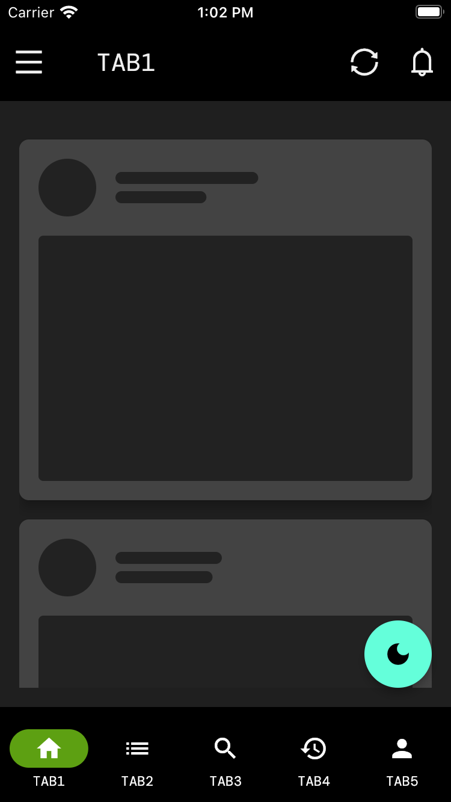

# app_scaffolding


[](https://github.com/felangel/mason)

Scaffold a mobile app starter project

_Generated by [mason][1] 🧱_

[](LICENSE)
[](https://flutter.dev/)


## Getting Started 🚀


### 🔖 Pre-requisites

To have the generated project working with Firebase, it requires:

0. Already initialized a Flutter project using `flutter create` or `nx-flutter:create`
1. Installed Firebase CLI
2. A Firebase Project

#### 1️⃣ Installed Firebase CLI

- Install [Firebase CLI](https://firebase.flutter.dev/docs/cli)

```
npm install -g firebase-tools
```

- Login to Firebase account that you will use to create a Firebase project.

```
firebase login
```

#### 2️⃣ A Firebase Project

Login to your Firebase console and [create a Firebase project](https://console.firebase.google.com/u/0/). Then, note the **project ID**.

### Make It

1. Make sure you already have Mason initialized in your project. If you don't, please [initialize first](https://github.com/zero-one-group/mobile_bricks#getting-started).
2. Run this command.
```
# initialize Mason 
mason make app_scaffolding
```

This is a starting point for a new brick.


## Features
*  Adapted from Clean Architecture with Riverpod state Management
*  ThemeMode toggle (Dark and Light) 🔥
*  Powered by ZOG UI with examples (`ZeroApp`)
*  Contants Generation to get rid of hadcoded texts
*  Localizations using `easy_localization`
*  Multiple flavors with multiple Firebase environments
*  Skeleton (shimmer) loading effect
*  Quick files generation with Mason CLI
*  Implementation example of cstom colors and typography


## 📸 Screenshots
<pre>
                                   
</pre>


## Quick start
This is a normal flutter app. You should follow the instructions in the [official documentation](https://flutter.io/docs/get-started/install).
This project uses **Riverpod** as a caching and data-binding framework


## Folder Structure 🔥

    # Root Project
    .
    |
    ├── lib                             
    │   ├── gen                         # All generated codes go here
    │   └── src                         # All the source code here
    │   │   ├── app                                 
    │   │   │   ├── config              # Flavor and app config    
    │   │   │   ├── firebase            # Store Firebase options       
    │   │   │   ├── theme               # App theme, typography, colors, etc
    │   │   ├── common_widgets          # Widgets used in many places accross the app.
    │   │   ├── constants               # Constants, extras keys, etc,
    │   │   ├── features                         
    │   │   │   ├── auth  
    │   │   │   │   ├── application     # Feature service and domain mapper goes here
    │   │   │   │   ├── data            # DTO, request and response objects, and repositories
    │   │   │   │   ├── domain          # UI Entity objects
    │   │   │   │   ├── presentation    # UI and the controllers and states                    
    │   │   │   ├── main  
    │   │   │   │   ├── application  
    │   │   │   │   ├── data  
    │   │   │   │   ├── domain  
    │   │   │   │   ├── presentation                    
    │   │   ├── localization            # Generated CodeGen loader, LocaleKeys, etc  
    │   │   ├── routing                 # Routes using Go Router
    │   │   ├── services                # Local and remote data handling service
    │   │   ├── utils                   # Extensions, validators, etc.
    └── test                            


## Built With 🛠
* [Riverpod Pattern](https://riverpod.dev/) - A Reactive Caching and Data-binding Framework
* [Go Router](https://pub.dev/packages/go_router/) - Declarative router for Flutter based on Navigation 2 
* [Equatable](https://pub.dev/packages/equatable) - Being able to compare objects in `Dart` often involves having to override the `==` operator.
* [Dio](https://github.com/cfug/dio) - A type-safe HTTP client.
* [Json Serializable](https://pub.dev/packages/json_serializable) - Builders for handling JSON.
* [Freezed](https://pub.dev/packages/freezed) - Code generation for immutable classes
* [Formz](https://pub.dev/packages/formz) - Form representation and validation in a generic way.
* [Hive DB](https://docs.hivedb.dev/) - Lightweight and blazing key-value database written in Dart.
* [Easy Localization](https://pub.dev/packages/easy_localization) - To simplify the internationalization and localization.
* [ZOG UI](https://pub.dev/packages/zog_ui) - Collection of ZOG design system UI components
* [Mason CLI](https://pub.dev/packages/mason_cli) - To create and consume reusable templates called bricks

## ABOUT ZOG UI

**IMPORTANT NOTE ON ZOG UI:** 

Zero One has just developed a package called [ZOG UI](https://pub.dev/packages/zog_ui). Its goal is to speed up the UI development process by providing a collection of ready-to-use components, yet still attempting to maintain their customizability.

However, **the package is currently still on alpha release and lacks documentation**. Therefore, consider using ZOG UI components pragmatically. If you encounter issues in some components, **DO** implement your own components instead of relying on all of ZOG UI components by trying to customize them.

## Todo
* [ ] Mason for NX workspace


## More Readings
A few resources to get you started if this is your first brick template:

- [Official Mason Documentation][2]
- [Code generation with Mason Blog][3]
- [Very Good Livestream: Felix Angelov Demos Mason][4]
- [Flutter Package of the Week: Mason][5]
- [Observable Flutter: Building a Mason brick][6]
- [Meet Mason: Flutter Vikings 2022][7]

[1]: https://github.com/felangel/mason
[2]: https://docs.brickhub.dev
[3]: https://verygood.ventures/blog/code-generation-with-mason
[4]: https://youtu.be/G4PTjA6tpTU
[5]: https://youtu.be/qjA0JFiPMnQ
[6]: https://youtu.be/o8B1EfcUisw
[7]: https://youtu.be/LXhgiF5HiQg
