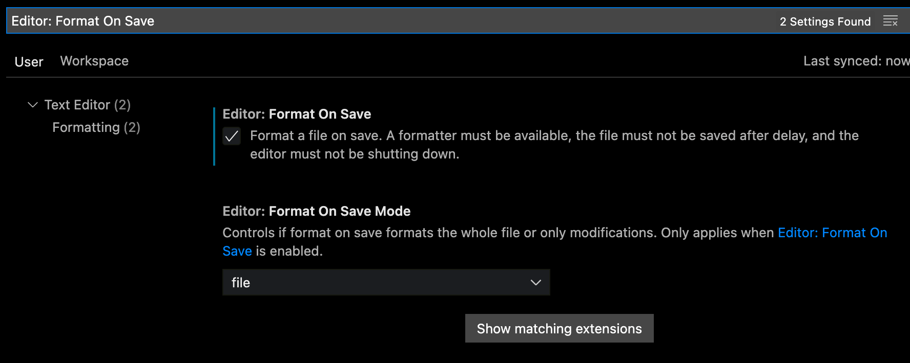

# Mobile Development Handbook

## Table of Contents

- [Mobile Development Handbook](#mobile-development-handbook)
  - [Table of Contents](#table-of-contents)
  - [Architecture](#architecture)
  - [Project Structure](#project-structure)
  - [Naming](#naming)
    - [Models](#models)
    - [Widgets](#widgets)
    - [Presentation](#presentation)
    - [Classes and Variables](#classes-and-variables)
  - [Code Styles](#code-styles)
    - [Linting](#linting)
    - [Formatting](#formatting)
      - [Methods](#methods)
      - [Widgets](#widgets-1)
  - [Commenting](#commenting)
  - [Localization](#localization)
  - [Flavoring](#flavoring)
  - [Routing](#routing)
  - [Error Handling](#error-handling)
  - [Generated Sources](#generated-sources)
  - [MR and Code Review](#mr-and-code-review)
  - [Security](#security)
  - [Tech Stack(s)](#tech-stacks)
  - [About ZOG UI](#about-zog-ui)
  - [Development Setup](#development-setup)
    - [Manual Setup](#manual-setup)
    - [Using Mason](#using-mason)
  - [Version Manager](#version-manager)
    - [Setup](#setup)
    - [Usage](#usage)
  - [Notes](#notes)


## Architecture

This architecture is composed of four layers (_data, domain, application, and presentation_) with their own responsibility and clear contract for how communication happens between layers. This architecture is adapted from [Clean Architecture by Uncle Bob](https://blog.cleancoder.com/uncle-bob/2012/08/13/the-clean-architecture.html) with the implementation of[ Riverpod State Management](https://riverpod.dev/docs/getting_started).


1. **Presentation Layer.** This layer is responsible to present data (widget) to screen and handle user interaction. This layer includes **_widgets_**, and their **_controllers_** and **_states_**.
2. **Application Layer.** This layer is optional. This layer holds **_services_** that can be used to bridge the presentation layer with the domain layer in order to serve data that the controller needs.
3. **Domain Layer.** Contains domain models called entities. Entities are objects that hold data that can be used for the presentation layer. This layer includes: **_Entity_** classes, which the UI needs to consume.
4. **Data Layer**. This layer includes both **_repositories_** and the **_models_** that represent objects that need to be sent to or received from the data sources (local or remote). There is repositories in this layer that can be used to :
    1. Isolate domain models (entities) from the implementation details of the data sources in the data layer.
    2. Map data transfer objects (response) to validated entities that are understood by the domain layer.
    3. (optionally) perform operations such as data caching.


## Project Structure


* The project structure follows _“Feature-First”_ architecture by default, whereby the feature folders are placed on top of the layer folders. This means that every feature has its own “presentation”, “application”, “domain”, and “data” folder underneath.
* In case there are repositories or models that are supposed to be shared across the app, they should be put separately on the same level as the “features” folder. Therefore the project structure can end up using the combination between _“Feature-First” _and_ “Layer-First”_ architecture.
* **NOT** every feature should include all the layer folders. The use of layer folders should depend on their necessity. 
* Count features according to their functionality rather than UI or screens.


## Naming


### Models


* If it is a representation of a REST API’s response, then use trailing “_response”. Example : `product_list_response.dar`
* If it is a representation of a REST API’s request, then use trailing “_request”. Example : `product_detail_request.dart`
* If it is an UI entity, then go without any trailing. Example : `product_list.dart`


### Widgets


* If the widget is an item of a list, then use the suffix “_item”. Example: `card_product_item.dart.`
* If the widget is used in multiple places, but does not belong to any screen, then use the suffix “_widget”. Example :` avatar_widget.dart`


### Presentation

* Controllers must use trailing “_controller”. Example : `login_controller.dart`
* States must use trailing “_state”. Example `: login_state.dart`
* Screens must use trailing “_screen”. Example :` login_screen.dart`
* Section widgets should use trailing  “_section”, be marked as private with leading underscore. Example : `_login_section.dart`
* Make the file naming be in accordance with its folder as much as possible. 

    Example:

* `product`
  * `list`
    *  `product_list_screen.dart`
  * `detail`
    *  `product_detail_screen.dart`

* `asset`
  * `icon`
    * `product_icon.png`
    * `assets.icon.[icon_name]` (generated by assetsgen)
  * `image`
    * `person_image.png`
    * `assets.image.[image_name]` (generated by assetsgen)
  * `logo`
    * `[logo_name]_logo.svg`
    * `assets.logo.[logo_name]` (generated by assetsgen)


### Classes and Variables

* General rules of naming for both classes and variables are per defined in [Effective Dart: Style | Dart](https://dart.dev/guides/language/effective-dart/style). 
* Variables naming within a project must be consistent and follow the same pattern. For example, whether you should name a variable of a `TextController` with `_conName` or `_nameTextController`, it’s all up to you. Do discuss amongst yourselves during the planning phase about what name pattern to go with according to your convenience.


## Code Styles

It's good to keep consistent code style, at least project-wide, and Dart/Flutter does come with linting support.


### Linting

We're using the [flutter_lints](https://pub.dev/packages/flutter_lints) package which contains recommended rules for Flutter apps.

Run linting by running “`flutter analyze`" in the root of the project or integrate linter with your IDE.


### Formatting

To format the code use` flutter format lib/` or `flutter format test/` command in the root of a project.

**Usage with VS Code**

Linting can be easily integrated via Flutter extension.

With this extension, you can find analysis issues in the Problems tab: VS Code linting.

To see issues next to the affected line, use the _Error Lens_ extension.

**Auto-formatting on file save**

Enable automatic code formatting on each file save by settings Manage (Bottom left cog icon) ➡ Settings, then search for Editor: Format On Save and enable the checkbox:




#### Methods

* Use soft-tabs with a two-space indent. For more indentation and spacing rules, follow [the Official Dart Formatting rule](https://github.com/dart-lang/dart_style/wiki/Formatting-Rules).
* **Blank lines:** Separate each abstract method using a blank line for better readability.

```dart
abstract class Human {
  void speak();

  void run();
}
```

* **Line breaks:**
    * Use the line break before each parameter in a method when it exceeds the line length.
    * Always use a line break for the method with more than two parameters.
* Use trailing comma at the end of a parameter list in functions, methods and constructors. If there is only one parameter, you can leave out the comma.

**Good:**

```dart
void createAccount(
  String firstName,
  String lastName,
  String email,
  String phoneNumber,
) {
  // Your code
}
```

**Bad:**

```dart
void createAccount(String firstName, String lastName, String email, String phoneNumber) {
  // Your code
}
```


#### Widgets

* Add widget keys in every widget for testing purposes.

```dart

class SignInScreen extends ConsumerStatefulWidget {
  const SignInScreen({super.key});

  static const _key = 'SignInKey';
  static const scaffoldKey = Key("scaffold.$_key");
  static const logoKey = Key("logo.$_key");
  static const emailTextFieldKey = Key("emailTextField.$_key");
  static const passwordTextFieldKey = Key("passwordTextField.$_key");
  static const btnSignInKey = Key("btnSignIn.$_key");
  static const btnForgotPasswordKey = Key("btnForgotPassword.$_key");
  static const signUpKey = Key("signUp.$_key");

  @override
  ConsumerState<SignInScreen> createState() => _SignInScreenState();
}

```
* Prefer splitting the code into small widgets in order to avoid large nested trees. The debugging process will become easy to check the UI issues. Besides, the widget tree is readable and clean. 

* When separating widget trees, consider creating new widgets rather than using helper method [^1]. 

**Good**:

```dart
class MyWidget extends StatelessWidget {
  @override
  Widget build(BuildContext context) {
    return Scaffold(
      body: Column(
        children: [
          _HeadingWidget(),
          _BodyWidget(),
          _FooterWidget(),
        ]
      )
    );
  }
}

class _HeadingWidget extends StatelessWidget {
  @override
  Widget build(BuildContext context) {
    return Row(
      // the rest of descendant widgets
    );
  }
}

class _BodyWidget extends StatelessWidget {
  @override
  Widget build(BuildContext context) {
    return Column(
      // the rest of descendant widgets
    );
  }
}

class _FooterWidget extends StatelessWidget {
  @override
  Widget build(BuildContext context) {
    return Column(
      // the rest of descendant widgets
    );
  }
}

```

**Bad:**

```dart
Widget build(BuildContext context) {
    return Scaffold(
      body: Column(
        children: [
          _headingWidget(),
          _bodyWidget(),
          _footerWidget(),
        ],
      ),
    );
  }

  Widget _headingWidget() {
    return Container(
        // the rest of the widget tree
        );
  }

  Widget _bodyWidget() {
    return Container(
        // the rest of the widget tree
        );
  }

  Widget _footerWidget() {
    return Container(
        // the rest of the widget tree
        );
  }   

```


 **Worse:**
 
 ```dart
 Widget build(BuildContext context) {
    return Scaffold(
      body: Column(
        children: [
          Row(
            children: [
              Container(
                child: Column(
                  children: [
                    Row(
                      children: [
                        Container(),
                        // and so on.
                      ],
                    ),
                  ],
                ),
              ),
            ],
          ),
          Row(
            children: [
              Container(),
              // and so on
            ],
          ),
        ],
      ),
    );
 }
 ```

* Separate widgets wisely. The separation can be by reusability or according to the UI design. 
* Add `const` before the widget whenever possible. By adding this keyword, the constant widget is NOT re-rendered when rebuilding the parent widget, improving the application performance[^2]. 

```dart
Center(child: const Text('Hello World!'));
```

## Commenting

Commenting is used as communication media amongst developers. Better code requires less comment. Here are the general rules.

* Be as concise as possible. 
* Give code snippet examples only if needed.
* Use _DartDoc_ comments to document code that you can access from other code (e.g. members and types, as recommended by the [Effective Dart](https://dart.dev/guides/language/effective-dart/documentation) guide), especially since they allow you to go into detail (by adding rich content) with Markdown formatting provided by _DartDoc_.
* Use regular comments (double slashes) to document your pieces of code, e.g. inside a method.
* Shared components or utility classes that are beneficial should have their exposed members/types documented, so other developers can catch on with its functionality quickly.
* Always use `// TODO:` in comments to mark incomplete implementations, such as hard-coded value, quick-fixes rather than proper fixes, or simply things that need for later improvement.

Must read about code-commentings.

1. [Effective Dart: Documentation | Dart](https://dart.dev/guides/language/effective-dart/documentation)
2. [Best practices for writing code comments - Stack Overflow Blog](https://stackoverflow.blog/2021/12/23/best-practices-for-writing-code-comments/) 


## Localization

The teams use [easy_localization](https://pub.dev/packages/easy_localization) for localizations.

* Consider using code generation tools such as [flutter_gen](https://pub.dev/packages/flutter_gen) instead of manually hard-coding all the Locale Keys.
* Always mark unlocalized or any other hard-coded texts using .`hardcoded` method which is defined on the String extension.

Example: 
    
```dart
extension StringExt on String {
   String hardcoded => this;
}

'Thank you for registering'.hardcoded
```


## Flavoring

* Project should be set up with at least two or three  flavors which represent different development environments; **dev** and **prod** or **dev**, **stg**, and **prod.** [^3]

* Each flavor has to have its own app names, and Android’s applicationId , and iOS’s bundleId. The typical differentiation is by adding `".dev"` suffix to the Android’s applicationId and iOS bundle ID for development environment, and `".stg"` for staging environment. As for the production environment, we leave the original application/bundle ID. Example: 
  * For production: `com.yourcompany.app`
  * For staging: `com.yourcompany.app.stg`
  * For development: `com.yourcompany.app.dev`
    
* Strongly consider registering different Firebase projects for every flavor or development environment.[^4]


Further reading: 

- [Overview of environments  |  Firebase Documentation (google.com)](https://firebase.google.com/docs/projects/dev-workflows/overview-environments)
- [General best practices for setting up Firebase projects  |  Firebase Documentation (google.com)](https://firebase.google.com/docs/projects/dev-workflows/general-best-practices)


## Routing

The teams use [GoRouter](https://pub.dev/packages/go_router) as the default navigation handler.

* Use `dependency_overrides` in order to use the latest version of GoRouter.
* Avoid the use of nested navigations where the parent redirects to its own child. This leads to a blank screen when doing a pop navigation as the parent is the upper level of the navigation.
* Consider splitting the routes tree into small files according to modules in order to get rid of large routing trees. Example: `_auth_routes.dart, _home_routes.dart, _payment_routes.dart,` etc.


## Error Handling

* Consider using [FlutterError](https://docs.flutter.dev/testing/errors).
* It is encouraged to implement [ApiResult](https://dev.to/ashishrawat2911/handling-network-calls-and-exceptions-in-flutter-54me) to handle all Network Calls and Exceptions.
* Implement [runZonedGuarded](https://api.flutter.dev/flutter/dart-async/runZonedGuarded.html) for more safety.


## Generated Sources

By generated source code, we mean something like `.g.dart` or .freezed.dart files which are generated using the <code>[build_runner](https://pub.dev/packages/build_runner)</code> package. 

* Commit the generated files to the source tree.
* Never manually edit the generated files.
* Generated source code files should have a .g.dart extension (except when using _freezed_)
* Exclude the generated files in the `analysis_options.yaml`

```bash
analyzer:
  exclude:
    - "**/*.g.dart"
    - "**/*.freezed.dart"
    - "test/.test_coverage.dart"
    - "bin/cache/**"
    - "lib/generated_plugin_registrant.dart"
```


## MR and Code Review

* Make sure the merge request complies  
* It would be better to attach screenshots or screen records when the MR is related to UI implementation.
* If any, put additional information such as changelog or any other information you think the others should be aware of.
* Add a reviewer on the MR. While we are all reviewers, there are some cases when you need a specific engineer to be aware of the changes you have made. For instance, when you are making changes to the code authored by another. In that case you are supposed to request a review from him/her.
* Post the information about the MR on Slack.

> **Note**: You own your whole app. Put code reviews at the same importance as doing your own tasks.


## Security


* Avoid using `print()` anywhere in the codebase, use `log()` instead.
* Never store credentials such as JWT token, etc on `SharedPreferences`. Instead, use [Hive](https://pub.dev/packages/hive_flutter) or [secure_storage](https://pub.dev/packages/flutter_secure_storage).
* It is fine to commit private configuration files such as Firebase’s `google-services.json` or `GoogleService-info.plist` as long as we are using private repositories that are only accessible by the development team and clients.
* For Android builds, implement [code obfuscation](https://docs.flutter.dev/deployment/obfuscate) and upload dSym file to Firebase Crashlytics dashboard in order for Crashlyitics to decode the crash report into readable stack traces[^5].

## Tech Stack(s)

Here are a couple commonly used dependencies that become our standard stacks.

* [Flutter Riverpod](https://pub.dev/packages/flutter_riverpod)
* [GoRouter](https://pub.dev/packages/go_router)
* [Firebase Core](https://pub.dev/packages/firebase_core)
* [Firebase Crashlytics](https://pub.dev/packages/firebase_crashlytics)
* [Firebase Messaging](https://pub.dev/packages/firebase_messaging)
* [Firebase Analytics](https://pub.dev/packages/firebase_analytics) (optional)
* [Dio](https://pub.dev/packages/dio) 
* [Cached Network Image](https://pub.dev/packages/cached_network_image)
* [Flutter Screen Util](https://pub.dev/packages/flutter_screenutil)
* [JSON Serializable](https://pub.dev/packages/json_serializable) and[ JSON Annotation ](https://pub.dev/packages/json_annotation)
* [Freezed](https://pub.dev/packages/freezed) and [Freezed Annotation](https://pub.dev/packages/freezed_annotation)
* [Hive](https://pub.dev/packages/hive_flutter)
* [Flutter Local Notifications](https://pub.dev/packages/flutter_local_notifications)
* [Mocktail](https://pub.dev/packages/mocktail)


## About ZOG UI

Zero One has developed a package called [ZOG UI](https://pub.dev/packages/zog_ui). Its goal is to accelerate the UI development process by providing a collection of ready-to-use components, yet still attempting to maintain their customizability.

However, the package is currently still on alpha release and lacks documentation. Therefore, consider using ZOG UI components pragmatically. If you encounter issues in some components, **DO** implement your own components instead of relying on all of ZOG UI components by trying to customize them.


## Development Setup

A new project can be initialized either manually or by using Mason.


### Manual Setup

* [ ] Create a project (communicate with the Infra team).
* [ ] Setup multiple flavors/schemes
    * [ ] Different App Name
    * [ ] Different App/Bundle ID
    * [ ] Flavor Banners
* [ ] Integrate with firebase project
    * [ ] Different firebase project for different flavors
* [ ] Setup project architecture
    * [ ] Structuring folder
    * [ ] Setup common function/extension/etc
* [ ] Setup GoRouter
* [ ] Setup theme (color, font, shadow, gap)
    * [ ] Component Styles
    * [ ] Colors
    * [ ] Typography
    * [ ] Dimensions / Sizes
    * [ ] Theme Mode (if required)
* [ ] Setup components (common widgets)
* [ ] Setup network client(s)
* [ ] Setup network exceptions
* [ ] Setup localization
    * [ ] Translations assets
    * [ ] Code generation
* [ ]  Setup Firebase Crashlytics
* [ ]  Setup Firebase Analytics (optional)
* [ ]  Setup FVM


### Using Mason

For project initialization, instead of having a useless “counter app” and doing all the things repeatedly, it is encouraged to use [Mason](https://pub.dev/packages/mason) and [Mason CLI](https://pub.dev/packages/mason_cli). It is used to accelerate the development by quickly generating consistent code called _bricks_. 

We already have a repository that hosts our internal bricks. Please refer to the [Zero One Mobile Bricks](https://gitlab.zero-one-group.com/zo-group/software/mobile_bricks)’s read.me. The brick named “[app_scaffolding](https://gitlab.zero-one-group.com/zo-group/software/mobile_bricks/-/tree/main/app_scaffolding)” will generate a starter project for you with pretty much all of the above setup checklist already set.

Further reading about Mason: [🚀 Overview | BrickHub Docs](https://docs.brickhub.dev/)


## Version Manager

Due to the diversity of projects the teams work on, each application usually requires different versions of Flutter. Use versions managers to allow you to install and switch between different versions effortlessly.

[fvm](https://fvm.app/) is the preferred version manager for Flutter.


### Setup

There are two ways to configure **FVM**, through CLI or desktop app (desktop app will probably be easier). You can read more at [https://github.com/leoafarias/fvm](https://github.com/leoafarias/fvm). Once the setup is done, you will have the `/.fvm/fvm_config.json `file`.`

Only commit that json file, the SDK symlink should not be included. To do that add to `.gitignore:`


### Usage

After the FVM is set up, all members need to use FVM instead of regular flutter. For command lines, use the “**fvm”** prefix. So, instead of writing `flutter pub run build_runner`, you should write `fvm flutter pub run build_runner.`

Now all your run, debug and other tools should use the FVM version of Flutter.

> **IMPORTANT:** This is per project setting which means that you need to change it for each project in every IDE for which you want to use FVM.


<!-- Footnotes themselves at the bottom. -->
## Notes

[^1]:

     [Widgets vs helper methods | Decoding Flutter - YouTube](https://www.youtube.com/watch?v=IOyq-eTRhvo&ab_channel=Flutter) 

[^2]:

     [The flutter “const” Keyword demystified. | by Kefeh Collins | Flutter Community | Medium](https://medium.com/flutter-community/the-flutter-const-keyword-demystified-c8d2a2609a80) 

[^3]:

     [Overview of environments  |  Firebase Documentation (google.com)](https://firebase.google.com/docs/projects/dev-workflows/overview-environments)

[^4]:

     [General best practices for setting up Firebase projects  |  Firebase Documentation (google.com)](https://firebase.google.com/docs/projects/dev-workflows/general-best-practices)

[^5]:

     [Get readable crash reports in the Crashlytics dashboard  |  Firebase Crashlytics (google.com)](https://firebase.google.com/docs/crashlytics/get-deobfuscated-reports?platform=ios)
