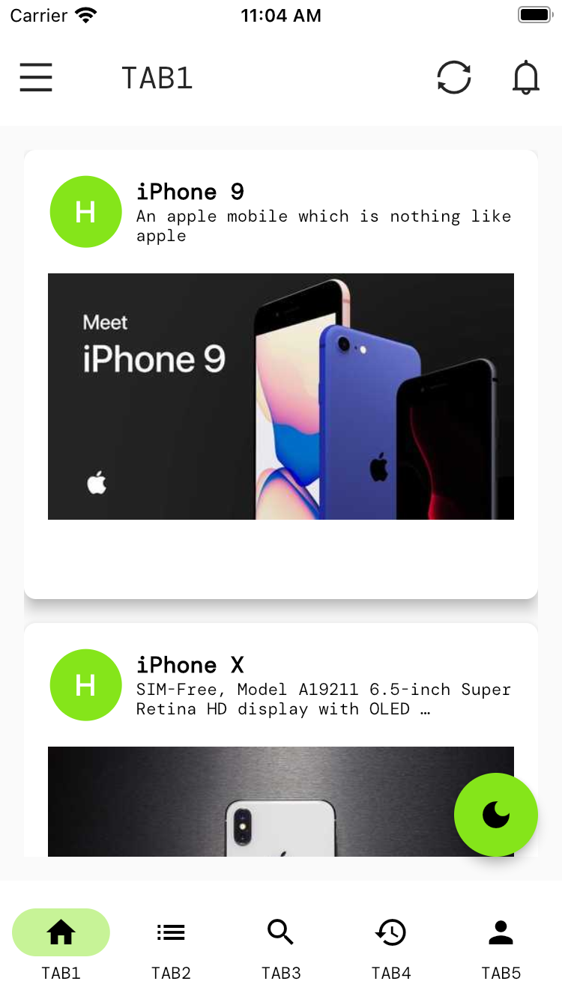
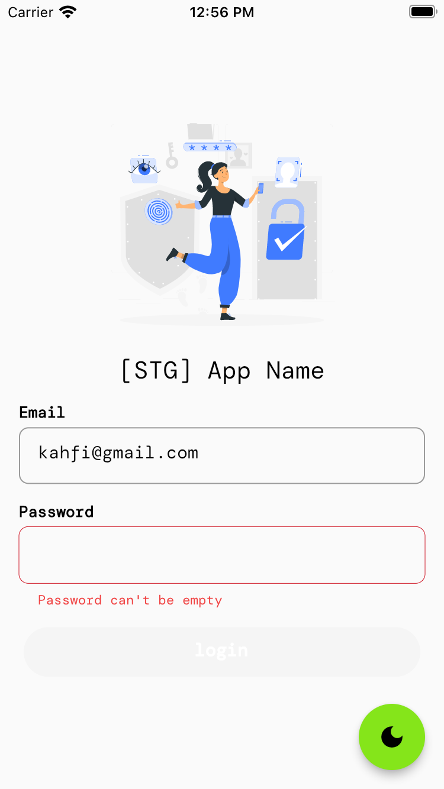
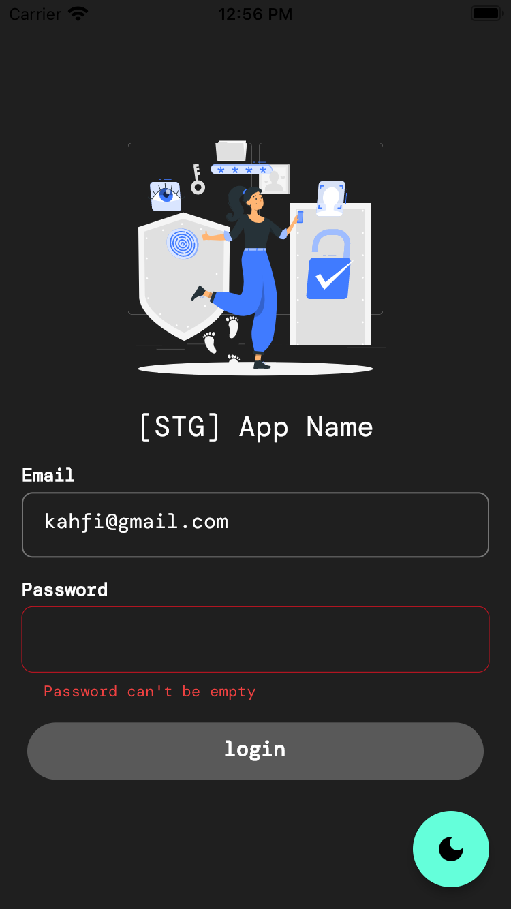
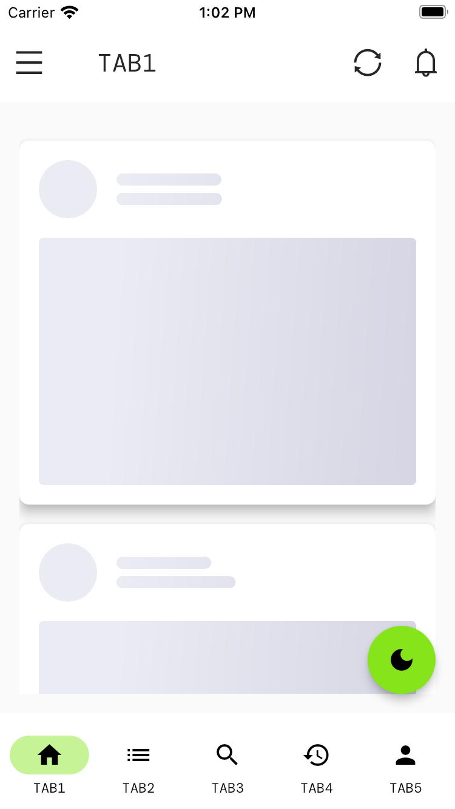
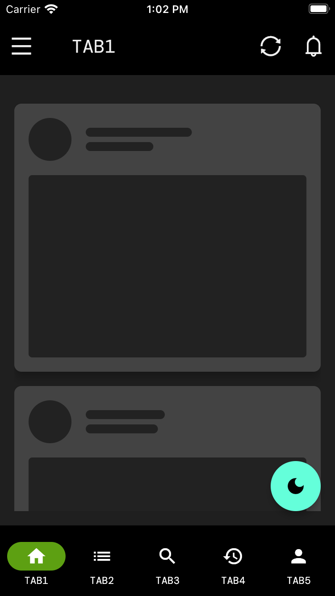

# ZOT Starter App

[](LICENSE)
[](https://flutter.dev/)


## Features
*  Adapted from Clean Architecture with Riverpod state Management
*  ThemeMode toggle (Dark and Light) 🔥
*  Powered by ZOG UI with examples (`ZeroApp`)
*  Contants Generation to get rid of hadcoded texts
*  Localizations using `easy_localization`
*  Multiple flavors with multiple Firebase environments
*  Skeleton (shimmer) loading effect
*  Quick files generation with Mason CLI
*  Implementation example of cstom colors and typography


## 📸 Screenshots
<pre>
                                   
</pre>


## Quick start
This is a normal flutter app. You should follow the instructions in the [official documentation](https://flutter.io/docs/get-started/install).
This project uses **Riverpod** as a caching and data-binding framework


## Folder Structure 🔥

    # Root Project
    .
    |
    ├── lib                             
    │   ├── gen                         # All generated codes go here
    │   └── src                         # All the source code here
    │   │   ├── app                                 
    │   │   │   ├── config              # Flavor and app config    
    │   │   │   ├── firebase            # Store Firebase options       
    │   │   │   ├── theme               # App theme, typography, colors, etc
    │   │   ├── common_widgets          # Widgets used in many places accross the app.
    │   │   ├── constants               # Constants, extras keys, etc,
    │   │   ├── features                         
    │   │   │   ├── auth  
    │   │   │   │   ├── application     # Feature service and domain mapper goes here
    │   │   │   │   ├── data            # DTO, request and response objects, and repositories
    │   │   │   │   ├── domain          # UI Entity objects
    │   │   │   │   ├── presentation    # UI and the controllers and states                    
    │   │   │   ├── main  
    │   │   │   │   ├── application  
    │   │   │   │   ├── data  
    │   │   │   │   ├── domain  
    │   │   │   │   ├── presentation                    
    │   │   ├── localization            # Generated CodeGen loader, LocaleKeys, etc  
    │   │   ├── routing                 # Routes using Go Router
    │   │   ├── services                # Local and remote data handling service
    │   │   ├── utils                   # Extensions, validators, etc.
    └── test                            


## Built With 🛠
* [Riverpod Pattern](https://riverpod.dev/) - A Reactive Caching and Data-binding Framework
* [Go Router](https://pub.dev/packages/go_router/) - Declarative router for Flutter based on Navigation 2 
* [Equatable](https://pub.dev/packages/equatable) - Being able to compare objects in `Dart` often involves having to override the `==` operator.
* [Dio](https://github.com/cfug/dio) - A type-safe HTTP client.
* [Json Serializable](https://pub.dev/packages/json_serializable) - Builders for handling JSON.
* [Freezed](https://pub.dev/packages/freezed) - Code generation for immutable classes
* [Formz](https://pub.dev/packages/formz) - Form representation and validation in a generic way.
* [Hive DB](https://docs.hivedb.dev/) - Lightweight and blazing key-value database written in Dart.
* [Easy Localization](https://pub.dev/packages/easy_localization) - To simplify the internationalization and localization.
* [ZOG UI](https://pub.dev/packages/zog_ui) - Collection of ZOG design system UI components
* [Mason CLI](https://pub.dev/packages/mason_cli) - To create and consume reusable templates called bricks

## Todo
* [ ] Add Linting
* [ ] Use Isar for Hive replacement
* [ ] Push Notification
* [ ] Deep Link
* [ ] Modularization
* [ ] Responsive UI
* [ ] Integration Testing
* [ ] Unit Testing (Mocktail with Riverpod)


## How to run the App
1. Clone this project.
2. Open with your favorite tools editor.


## Run the App using command prompt


```console
flutter run --flavor dev --dart-define=API_URL='<your_api_url>'
```


## How to run the Test
### Integration Testing (will be modified, for now it's not working)
```console
flutter drive --target=test_driver/app.dart --flavor development
```


## Author

* **ZOT Team**

Don't forget to follow us, fork and give us a ⭐


## License

```
MIT License

Copyright (c) [2020] [Zero One Technology]

Permission is hereby granted, free of charge, to any person obtaining a copy
of this software and associated documentation files (the "Software"), to deal
in the Software without restriction, including without limitation the rights
to use, copy, modify, merge, publish, distribute, sublicense, and/or sell
copies of the Software, and to permit persons to whom the Software is
furnished to do so, subject to the following conditions:

The above copyright notice and this permission notice shall be included in all
copies or substantial portions of the Software.

THE SOFTWARE IS PROVIDED "AS IS", WITHOUT WARRANTY OF ANY KIND, EXPRESS OR
IMPLIED, INCLUDING BUT NOT LIMITED TO THE WARRANTIES OF MERCHANTABILITY,
FITNESS FOR A PARTICULAR PURPOSE AND NONINFRINGEMENT. IN NO EVENT SHALL THE
AUTHORS OR COPYRIGHT HOLDERS BE LIABLE FOR ANY CLAIM, DAMAGES OR OTHER
LIABILITY, WHETHER IN AN ACTION OF CONTRACT, TORT OR OTHERWISE, ARISING FROM,
OUT OF OR IN CONNECTION WITH THE SOFTWARE OR THE USE OR OTHER DEALINGS IN THE
SOFTWARE.
```
